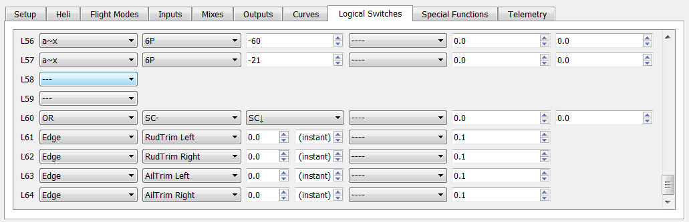
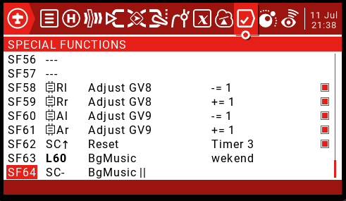
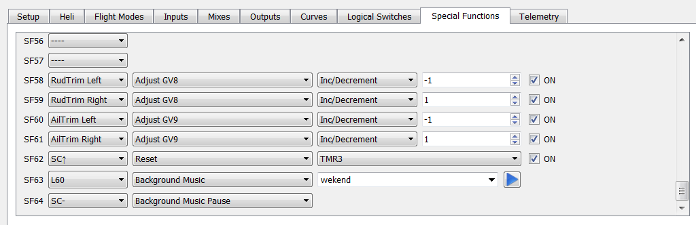

TaraniTunes v4.2
===========
**Awesome music player for FrSky radios.**  
     
Key Enhancements
----------------    
** Resizable zone widget works in all zones Including the Top Bar      
** changed the code to allow changes to the switches outside of lua
** Includes full screen layout for Horus, Jumper, and Radiomaster series radios.  
    
Existing Features
-----------------   
** Playlists are separated by recognizable names you have chosen (3D Flying, Rock-N-Roll, Classic Rock, My Mix, Relaxing).   
** On-screen confirmation of the playlist selected.    
** Automatic song advancement.  
** Compatible with Most common color screen radios FrSky Horus Radios, Radiomaster and Jumper radios running at least [OpenTX](http://www.open-tx.org) 2.3.    

Great Features  
  
         
     
  
      
  
  
### Installation
1. On your computer:
	1. Edit  `main.lua` to have your desired amount of playlists and other individual likings. Create a new folder under Widgets **Why not Name it iTunes...**  Place the "main.lua" file in the `/WIDGETS/iTunes` directory on your SD card.  

	2. Create a folder "lists" under `/SOUNDS`

	3. Create separate folders under "lists" for each desired playlist on your SD card. The folder names should pertain to the music played. **Do not add spaces to the directory names**
Examples >> `/SOUNDS/lists/3dflying`, `/SOUNDS/lists/practice`, `/SOUNDS/lists/hardrock`, `/SOUNDS/lists/competition`

2. Create a "playlist.lua" file in each of those directories.
	1. I recommend using [`Mp3tag`](https://www.mp3tag.de/en/index.html) to create your playlists. It will automatically add the required informations in TaraniTunes’ format. *Please look at the instructions in [`Auto_Playlist`](/Auto_Playlist)*.

	2.  If you prefer to manually create the playlist files. Each line must be formatted like this:   
	`{"Song name", "SONG_FILENAME", duration},`
		1. `Song name` is the full name, with artist if you want.
		2. `SONG_FILENAME` must be 6 characters or less.
		3. `duration` is your song’s duration in seconds. *EXAMPLE - Your song is 3:45 long you would enter 225. For a 4:52 song enter 292. Simply calculate `minutes × 60 + seconds` to get your song’s duration. Song length can usually be found in the file’s properties.*  

 Look at [playlist.lua](/playlist.lua) for an example of the required structure of the file.

3. Put your corresponding songs `SONG_FILENAME.wav` in `/SOUNDS/en` if your radio is in English (otherwise replace `en` with your language). They must be converted to mono, preferably normalized, and encoded in Microsoft WAV 16-bits signed PCM at a 32 kHz sampling rate, you can use [Audacity](http://www.audacityteam.org) to do that, it works great. Remember the filename must be 6 characters or less or else it will not play and the widget will cease to work.

4. On your Taranis or (in companion) **This is how I setup my radio:
	1. Set “TIMER3” as follows:      
	    
 	The inverse middle position of your chosen "3" position switch is the best practice for running the widget.        
                 
	2. Set active “FLIGHT MODES” model rudder and alieron trims as follows :     
	  
	 (Change to your desired control trims)           
	                
	3. The playlist selector uses GV9 .... The program will set this item:     
	    
	                     
	4. Set the the “LOGICAL SWITCHES” settings as follows:    
	   
	L61 and 64 need to changed to the desired 3 position switch you will be using for playing and pausing the music.     
	Here are the logical switch settings for setting up the program in companion    
	      
	                                    
	5.Set the the “SPECIAL FUNCTION” settings as follows:      
  	  
	Here are the special function settings for setting up the program in companion    
	    
	         
There you go! Next section will explain how to use TaraniTunes.    

### Usage

The program is written to work within the widget space it is provided (from just the small top bar to full screen with no trims or top bar visible).        
          
1. Put the “SC” switch in the lower position to start playing the music.
2. Put the "SC" switch in the Middle position to pause the song. It will continue from where it left off when the switch is returned to the lower "play" position.  When the song ends, the next song will automatically play and “Timer3” will be reset.
3. Press Rudder right / left trim to select and play next or previous song respectively.     
4.  Put the “SC” switch in the upper (away) position. **The SC switch acts as an enter button.**   Return the "SC" to the lower position and the newly selected song will begin to play.    
###  If the SC switch is not put in the away position, the current song and timer is not cleared from the lua memory and the currently playing song will continue to play until the timer it is over.  The timer and the music will be out of sync with the screen for a couple of songs, but it will normalize eventually  To correct the out of sync condition, move  the SC to the away position (enter) and return it to the play position.    

### Change Playlists     
1. Press Aileron right / left trim to select the next or previous playlist respectively.  
2. Put the “SC” switch in the upper (away) position.  Again **The SC+ switch acts as an enter button.**   
3. Return the "SC" to the lower position and the newly selected playlist will begin to play

**Tweek and make any enhancements you need too in order to Enjoy it as much as I do.  
**If you want the background I am using it is in the `Screenshots3` folder
