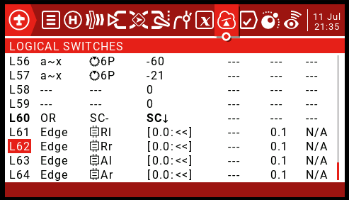

TaraniTunes v4.1
===========
**Awesome music player for FrSky radios.**  
     
Key Enhancements
----------------    
** Resizable zone widget works in all zones Including the Top Bar      
** Added index numbers for trims to eaily change it to your switch/trim preferences.    
** Includes full screen layout for Horus, Jumper, and Radiomaster series radios.  
    
Existing Features
-----------------   
** Playlists are separated by recognizable names you have chosen (3D Flying, Rock-N-Roll, Classic Rock, My Mix, Relaxing).   
** On-screen confirmation of the playlist selected.    
** Automatic song advancement.  
** Ramdon song selection.  
** Compatible with Most common color screen radios FrSky Horus Radios, Radiomaster and Jumper radios running at least [OpenTX](http://www.open-tx.org) 2.3.    

* Great Features  
      
  
* Screenshot Full size
    
  
 * Screenshot 1/4 size
    
  
### Installation
1. On your computer:
	1. Edit  `main.lua` to have your desired amount of playlists and other individual likings. Create a new folder under Widgets **Why not Name it iTunes...**  Place the "main.lua" file in the `/WIDGETS/iTunes` directory on your SD card.  

	2. Create a folder "lists" under `/SOUNDS`

	3. Create separate folders under "lists" for each desired playlist on your SD card. The folder names should pertain to the music played. **Do not add spaces to the directory names**
Examples >> `/SOUNDS/lists/3dflying`, `/SOUNDS/lists/practice`, `/SOUNDS/lists/hardrock`, `/SOUNDS/lists/competition`

2. Create a "playlist.lua" file in each of those directories.
	1. I recommend using [`Mp3tag`](https://www.mp3tag.de/en/index.html) to create your playlists. It will automatically add the required informations in TaraniTunes’ format. *Please look at the instructions in [`Auto_Playlist`](/Auto_Playlist)*.

	2.  If you prefer to manually create the playlist files. Each line must be formatted like this:   
	`{"Song name", "SONG_FILENAME", duration},`
		1. `Song name` is the full name, with artist if you want.
		2. `SONG_FILENAME` must be 6 characters or less.
		3. `duration` is your song’s duration in seconds. *EXAMPLE - Your song is 3:45 long you would enter 225. For a 4:52 song enter 292. Simply calculate `minutes × 60 + seconds` to get your song’s duration. Song length can usually be found in the file’s properties.*  

 Look at [playlist.lua](/playlist.lua) for an example of the required structure of the file.

3. Put your corresponding songs `SONG_FILENAME.wav` in `/SOUNDS/en` if your radio is in English (otherwise replace `en` with your language). They must be converted to mono, preferably normalized, and encoded in Microsoft WAV 16-bits signed PCM at a 32 kHz sampling rate, you can use [Audacity](http://www.audacityteam.org) to do that, it works great. Remember the filename must be 6 characters or less or else it will not play and the widget will cease to work.

4. On your Taranis or (in companion) **This is how I setup my radio:
	1. Set “TIMER3” as follows:      
	  
	2. Set active “FLIGHT MODES” model rudder trims as follows:     
	  
	In fact, put every 5 and 6 trims to “`--`” for every flight mode you use.  
	3. The playlist selector uses GV9 it program should set it if it does not this is the main reason for script failure (it calls a nil value if not set):     
	    
	4. adjust the “LOGICAL SWITCHES” settings to meet your needs mine is set as follows:    
	    
	**L60-L64 will be automatically installed there is no need to enter these values**    
	5. Under `Special Functions` add the following data at SF61 and SF62: (The music feature would not advance properly if I hard coded them).      
  	  
	
There you go! Next section will explain how to use TaraniTunes.    

### Usage

The program is written to work within the widget space it is provided from just the small top bar to full screen withno trims or top bar visible.     
1. Put the “SB” switch in the lower position to start playing the music.
2. Put the "SB" switch in the Middle position to pause the song. It will continue from where it left off when the switch is returned to the lower "play" position.
3. Put “SB” in the up position to select a random song from your playlist. It will play and select another song from your playlist when completed.  To pause the selected song, place SB in the middle position and then to the lower position to continue the song from where it was paused.  If you put the switch back in the upper position it will select a new song.
4. When the song ends, the next song will automatically play and “Timer3” will be reset.
5. Press t6 up / down trim to select and play next or previous song respectively.    
6. “Timer3” will also automatically reset if you change songs.     

### Change Playlists     
1. Pause the Music (put the Put the "SB" switch in the Middle position)
2. Press T5 up / down trim to select the next or previous playlist respectively.   
3. Put the “SB” switch in the lower position to start playing the music.
**The SB switch acts as an enter button.**   
If the music is not paused, the currently playing song will continue to play until it is over, then the current playlist will start playing.  

**Tweek and make any enhancements you need too in order to Enjoy it as much as I do.  
**If you want the background I am using it is in the `Screenshots3` folder

####  Housekeeping Notes  
If you have enhancements to the code you think others would enjoy either contact me or place an issue to get my attention.

