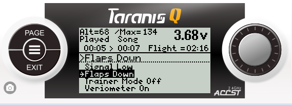
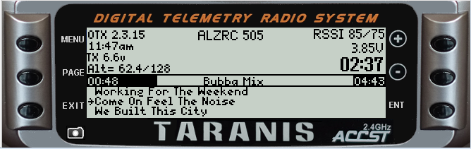

## TaraniTunes v4.4 Edge(color radios) v4.3(color OpenTX) and v4.0 (non-color radios)
  
**Awesome music player for OpenTX based radios. or any radio capable of running a lua script**  
*Originally this started as a separate advanced fork from the Original TaraniTunes developed by [GilDev](https://github.com/GilDev).     
GilDev and I agreed that both versions of the script (the original and this advanced version) would be available for users but hosted separately.*

---------------        
     
## TaraniTunes v4.4  (Widget for Edge Color Radios)    

Key Enhancements 
* Updated the Screen Preview to what I use.
* Added EdgeTX Logo used in the Widget Preview.
* Dark theme and background added (JW_Dark) with Carbon background.
* Repaired music skipping over the last playlist.
* Special Function Switch numbers added for Edge TX versions 2.8 through 2.10 for compatibility.
* Changed the hard coded (number) for background music to a Special Function Constant Variable.

Previous Enhancements 
* Model Global Variables allow the music and playlists to change without having to use a switch reset    
* Added Flush Audio for immediate play of a song or playlist as it is selected   
* Resizable zone widget works in all zones (including top bar). 
* Added index numbers for trims to easily change it to your switch/trim preferences.  
* Added full screen layout for Horus, Jumper, and Radiomaster series radios.  
* Streamlined screen layout. 
   
Existing Features for all radios  
* Playlists have recognizable names you have chosen (3D Flying, Rock-N-Roll, My Mix, etc.).  
* On-screen confirmation of the playlist selected.  
* Automatic song advancement.  
* The only limit to the number of playlists is SD Card size.  
* More screen room for telemetry items.  
* Progress Bar for the playing song length.  
* Compatible with radios running OpenTX or EdgeTX.  
----------------
## TaraniTunes v4.0  (Non Color Radios)  ##
Key Enhancements   
* Streamlined code to match the Color Widget version in both look and feel.    
* FlushAudio Added to clear song playing when a new song/playlist is selected.   
* Song or playlist immediately play when selected.  No need to move switches as an "Enter Key".    
* Model Global Variable 8 and 9 used is also used to keep track of the music and playlists.      
* Removed the separate player file all interaction is contained within the code.   
  
  There is a "Random Mode" version available for the "xlite, 9x or Q7" radios.  
  It is available here >>> https://github.com/jrwieland/TaraniTunes-v4.x/tree/random-mode
----------------

## Screenshots  
* Color Screen Radios  
    
  
* Taranis Q X7 and Xlite  
   
  
* Taranis X9D  
     

  
## Assets
EdgeTX color Radios [Edge_Color.zip](https://github.com/jrwieland/TaraniTunes-v4.x/releases/download/v4.4/v4.4-EdgeTX.zip)      
OpenTX Radios  [OpenTX_Color.zip](https://github.com/jrwieland/TaraniTunes-v4.x/releases/download/v4.3/Color.4.3.zip)      
Grayscale radios (9XD, QX7, Xlite etc.) [Grayscale.zip](https://github.com/jrwieland/TaraniTunes-v4.x/releases/download/v4.0-BW/4.0.B.W.zip)     

The Auto playlist folder contains the instructions for setting up playlists automatically to the correct format.  It makes it easy to create new lists.
