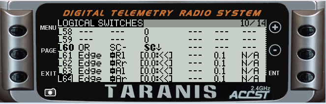
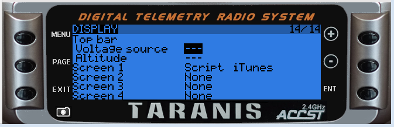

TaraniTunes v2.2 
===========
*Awesome music player for FrSky radios.*  
*This is a seperate Advanced fork from the Original TaraniTunes developed by [GilDev](https://github.com/GilDev)*

Key Improvements
----------------
** Multiple Playlists (the code contains 8 seperate playlists)  
** Playlists are seperated by recognizable names you have chosen (3dflying, Practice, Competition)  
** On-screen confimation of the playlist selected (not just a number anymore)  
** Songs are changed automatically based on their length  
** On-Screen Flight Time and Telementry Information   

Compatible with FrSky’s [Taranis Q X7](https://www.frsky-rc.com/product/taranis-q-x7-2), [Taranis X9D](https://www.frsky-rc.com/product/taranis-x9d-plus-2) and their variants.
You need at least [OpenTX](http://www.open-tx.org) 2.2.

* Taranis Q X7  
    
* Taranis X9D  
  

### Installation

A full working version for you to try on companion is available from my dropbox.  It uses your existing radio notifications as the sample music  [Download SD Card files](https://www.dropbox.com/sh/ojqjugozk2s4e9e/AADaXwY6DARqot-Jig9Xvx3Pa?dl=0) The Model file contains 1 model showing the use of the program.   

1. On your computer:
	1. Edit both `main.lua` and `itunes.lua` to have your desired amount of playlists. Detailed instructions are in the file(s) comments. Place both files in the `/SCRIPT/TELEMETRY` directory on your SD card.  

	2. Create a folder "lists" under /SOUNDS
	
	3. Create seperate folders under "lists" for each desired playlist on your SD card. The folder names should pertain to the music played. **Do not add spaces to the directory names**
Examples >> `/SOUNDS/lists/3dflying`, `/SOUNDS/lists/practice`, `/SOUNDS/lists/hardrock`, `/SOUNDS/lists/competition`

2. Create a "playlist.lua" file in each of those directories.
	1. I recommend using [`Mp3tag`](https://www.mp3tag.de/en/index.html) to create your playlists. It will automatically add the required informations in TaraniTunes’ format. *Please look at the instructions in [`Auto_Playlist`](/Auto_Playlist)*.

	2.  If you prefer to manually create the playlist files. Each line must be formatted like this:   
	`{"Song name", "SONG_FILENAME", duration},` 
		1. `Song name` is the full name, with artist if you want.
		2. `SONG_FILENAME` must be 6 characters or less. 
		3. `duration` is your song’s duration in seconds. *EXAMPLE - Your song is 3:45 long you would enter 225. For a 4:52 song enter 292. Simply calculate `minutes × 60 + seconds` to get your song’s duration. Song length can usually be found in the file’s properties.*  
 
 Look at [playlist.lua](playlist.lua) for an example of the required structure of the file.

3. Put your corresponding songs `SONG_FILENAME.wav` in `/SOUNDS/en` if your radio is in English (otherwise replace `en` with your language). They must be converted to mono, preferably normalized, and encoded in Microsoft WAV 16-bits signed PCM at a 32 kHz sampling rate, you can use [Audacity](http://www.audacityteam.org) to do that, it works great. Remember the filename must be 6 characters or less or else it will not play.

4. On your Taranis or (in companion) **This is how I setup my radio:
	1. Set “TIMER3” as follows:      
	  
	2. Set active “FLIGHT MODES” model rudder trims as follows:     
	  
	In fact, put every rudder trim to “`--`” for every flight mode you use.  
	3. Set “LOGICAL SWITCHES” settings as follows:  
	  
	**L60 will be automatically installed there is no need to enter these values**
	4. Under Telementry “DISPLAY” Choose to display `Script iTunes`  
	
	
There you go! Next section will explain how to use TaraniTunes.

### Usage

From the main screen, hold “Page” to access TaraniTunes.
1. Use the rotary encoder (QX7) or the “+”/“-” buttons on the (X9) to sweep through the songs.
2. Press “Enter” to choose a song to play.
3. Put the “SB” switch in the middle position to start playing.
4. Put the "SB" switch in the down position to pause the song. It will continue from where it left off when the switch is returned to the middle "play" position.
5. Put “SB” in the up position to select a random song from your playlist. It will play when the switch is placed in the middle "play" position.
6. Press rudder trim right or rudder trim left to play next or previous song respectively.
7. When the song ends, the next song will automatically play and “Timer3” will be reset.
8. “Timer3” will also automatically reset if you change songs.
9.  The screen does not have to be displayed for it to work.  You can have the music playing and use the telementry screen of your choice.  If you move the "`SB`" switch or trims the music will respond accordingly.  The only function that will not work on a different screen is selecting a new playlist (described below).

#### Changing Playlists

1. To change playlists press “MENU”.
2. A “Change Playlist Screen” will appear:  
     
3. Using **Rotary Switch S2**, select the playlist you want to play.
4. Press “ENTER”, your new playlist is loaded and begins playing.

Enjoy it as much as I do.

####  Housekeeping Notes  
If you make changes to your playlist.lua files .... delete the compiled file "`playlist.lauc`" The program will always read the compiled file despite any changes you make to the source file.   By deleting the compiled file, it will automatically compile a new file from the source file.  
The same goes for any changes to the itunes.lua file.
