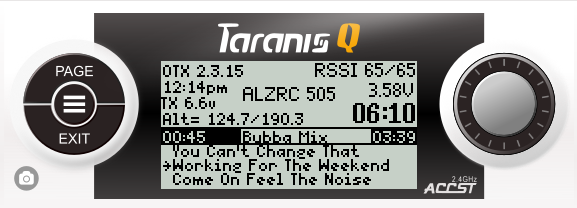

TaraniTunes v4.1 (color radios) and v3.01 (non-color radios)
===========
**Awesome music player for OpenTX based radios. or any radio capable of running a lua script**  
*Originally this started as a separate advanced fork from the Original TaraniTunes developed by [GilDev](https://github.com/GilDev).     
GilDev and I agreed that both versions of the script (the original and this advanced version) would be available for users but hosted separately.*

**Resizable zone widget works in all zones including the top bar!!!     
"Widget" creation for Radios running OpenTX on Color Radios     
     
### No changes were made to the "xlite, 9x or Q7"" radio's program.    
### There is a "Random Mode" version available for the "xlite, 9x or Q7" radios.  
It is available here >>> https://github.com/jrwieland/TaraniTunes-v4.x/tree/random-mode

Key Enhancements
----------------
** Resizable zone widget works in all zones    
** Added index numbers for trims to easily change it to your switch/trim preferences.    
** Added full screen layout for Horus, Jumper, and Radiomaster series radios.  
** Logical Switches and most of the special function switches added automatically.  
** Automatic selection and playing random songs from your playlist.  
** Streamlined screen layout.  
** [Multiple Playlists].  
** The only limit to the number of playlists is SD Card size.  
** Number of songs in the playlist is displayed on the selection screen.  
** More screen room for telemetry items.  
** Progress Bar for the playing song length.    

Existing Features
-----------------
** Playlists are separated by recognizable names you have chosen (3D Flying, Rock-N-Roll, Classic Rock, My Mix, Relaxing).   
** On-screen confirmation of the playlist selected.    
** Automatic song advancement.   
** Compatible with Most common radios FrSky Q X7, X lite 9X series, Horus Radios.  As well as the Radiomaster and Jumper radios running at least [OpenTX](http://www.open-tx.org) 2.3.    

* Color Screen Radios  
    
* Taranis Q X7 and Xlite  
    
* Taranis X9D  
  

  
### Installation
**For color Radios go the to the color screen folder for installation and usage!

**For Grayscale radios (9XD, QX7, Xlite etc.) got to the Grayscale Radios For installation and usage.

**The Auto playlist folder contains a the instructtions for setting up playlists automatically to the correct format.
